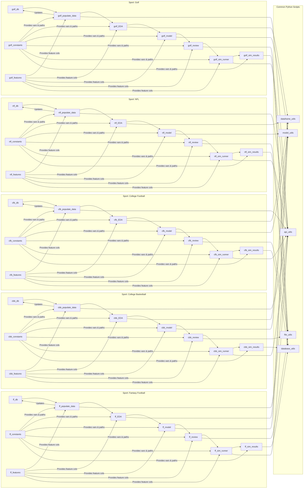

# ASBR Flow Chart

## Overview

This is a flowchart that visually shows how various pieces of code interact with each other in an application that's used to analyze sports and make betting predictions. Think of these blocks as different tasks or steps that your computer is performing to deliver the desired results.

## Breakdown

### Common Python Scripts
This is the base layer of the application where all the utilities required to interact with various data sources (like databases, files, etc.), manipulate data, etc. are contained. Think of it as the set of tools in a tool box. You have:

###### api_utils: Code to interact with different APIs (Application Programming Interface), like getting data from sports websites or databases.

###### model_utils: Code to create, run, and evaluate prediction models (which are like automated experts that can guess outcomes based on data).

###### dataframe_utils: Code for data manipulation and processing (like sorting players based on their scores).

###### database_utils: Code to manage interactions with the database (like a digital filing cabinet where all the data is stored).

###### file_utils: Code to handle file operations (like saving a bet history to a text file).

### Sport: 

##### Golf/NFL/College Football/College Basketball/Fantasy Football: Each of these is a specific application of the toolset above for a particular sport. 

For example, 'Sport: Golf' block includes code specific to analyzing golf games and making predictions. The structure is similar for each sport, with each block performing a specific function:

###### *_db: This is where all the data specific to that sport is stored.
###### *_constants: Here you find all the unchanging data and configuration specific to the sport (like the number of players in a team).
###### *_features: This is the block that prepares data in a way that the prediction models can understand (like transforming raw golf swing data into statistics).
###### *_populate_data: This block fetches and updates the sports data.
###### *_EDA: EDA stands for Exploratory Data Analysis. This block analyzes the data and looks for patterns and trends.
###### *_model: This block is where the magic happens - it's where the code makes predictions (like who will win a match) based on the analyzed data.
###### *_review: This block reviews the performance of the prediction models and provides insights.
###### *_sim_runner: This is where simulation runs are managed. It's like running a digital version of the game in fast forward using the models.
###### *_sim_results: This block handles the results of the simulations.

The arrows (-->) in the graph represent the flow of information or dependencies. For example, golf_db --> golf_populate_data means that golf_populate_data needs data from golf_db.

The blocks in the specific sports subgraphs (like 'Sport: Golf') also rely on tools from the 'Common Python Scripts'. For example, golf_populate_data --> A1 means that the Golf module uses api_utils to get its data.

All these blocks working together enable the application to simulate sports games and provide betting advice based on data and modeling. It's like having a team of sports analysts and statisticians working for you, but it's all done by code.
